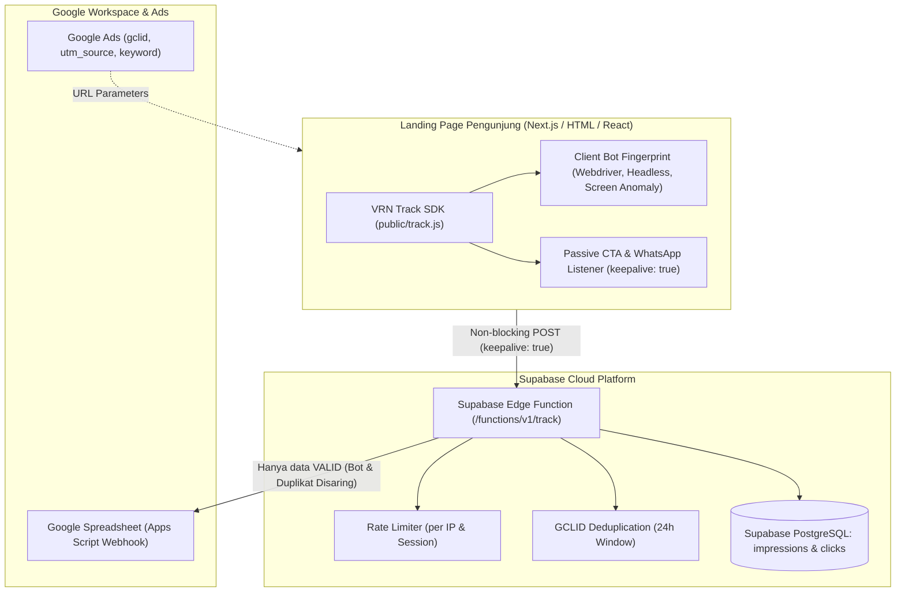

# VRN TRACK ADS — Enterprise Ad Tracking & Anti-Bot Analytics Platform

<p align="center">
  
</p>

<p align="center">
  <strong>Ultra-lightweight, High-Performance Ad Tracking & Anti-Bot Protection Platform</strong><br>
  Dirancang khusus untuk Google Ads, WhatsApp CTA, dan Landing Page modern dengan jaminan <em>Zero UX Interference</em>.
</p>

---

## 🚀 Fitur Unggulan

### 1. 🛡️ Advanced Bot & Click Fraud Protection
- **Client-Side Bot Fingerprinting (<1.5KB)**:
  - Deteksi `navigator.webdriver` aktif dan otomatisasi browser.
  - Heuristik Headless Browser (`PhantomJS`, `Nightmare`, `Puppeteer`, `Playwright`, `Selenium`, anomali Chrome tanpa runtime/plugins, ketiadaan `navigator.languages`).
  - Deteksi Anomali Resolusi Layar (`screen.width === 0`, `screen.availHeight === 0`, headless display viewport).
  - Filter otomatis User-Agent crawler, scraper, dan bot liar.
- **Server-Side Edge Protection (Supabase Edge Function)**:
  - Validasi ketat User-Agent pada edge server.
  - **Deduplikasi GCLID 24 Jam**: Memvalidasi Google Ads Click ID duplikat secara realtime untuk mencegah spam klik / fake clicks.
  - **Rate-Limiting per IP & Session Token**: Menangkal serangan spam klik berulang walaupun bot mencoba rotasi user-agent.
  - **Google Sheets Fraud Shielding**: Data yang terdeteksi sebagai Bot Fraud atau Duplikat GCLID **disaring secara ketat dan TIDAK diteruskan ke Google Spreadsheet**, menjaga keakuratan laporan keuangan dan performa iklan Anda.

### 2. ⚡ Zero UX Interference (Performance & UX Guarantee)
- **100% Non-Blocking**: Menggunakan atribut `async defer` dan pemuatan asinkron.
- **Instant Click & CTA Navigation**:
  - Event listener bersifat passive capture tanpa pernah memanggil `event.preventDefault()`.
  - Klik WhatsApp (`wa.me`, `api.whatsapp.com`) dan nomor telepon (`tel:`) terbuka seketika tanpa jeda milidetik atau buffering.
- **Fetch Keepalive & SendBeacon**: Request pelacakan dikirim di latar belakang peramban menggunakan `fetch(..., { keepalive: true })` sehingga data tetap terkirim saat pengguna langsung berpindah halaman/aplikasi.
- **Zero CLS & Silent Handling**: Tidak ada injeksi DOM, popup, alert, atau layout shift. Seluruh error koneksi ditangani secara *silent* tanpa mengganggu script utama website.

---

## 🏗️ Arsitektur Sistem



---

## 📦 Panduan Pemasangan SDK

### 1. HTML / PHP Native (Landing Page)
Tambahkan tag `<script>` berikut di dalam tag `<head>` atau sebelum penutup `</body>`:

```html
<!-- VRN TRACK ADS SDK -->
<script 
  src="https://DOMAIN_ANDA.com/track.js" 
  data-tracking-id="MASUKKAN_TRACKING_KEY_ANDA" 
  async 
  defer>
</script>

<!-- Contoh Tombol WhatsApp (Otomatis Terlacak Tanpa Delay) -->
<a href="https://wa.me/6281234567890?text=Halo%20Admin" class="btn-cta">
  Hubungi Kami via WhatsApp
</a>
```

> **Catatan**: Script secara otomatis merekam *impression* saat halaman dibuka dan merekam *click* saat pengunjung mengklik link WhatsApp atau tombol dengan atribut `data-vrn-click`.

---

### 2. Next.js (App Router 13 / 14 / 15)
Tambahkan pada file root layout `app/layout.tsx`:

```tsx
import Script from 'next/script';

export default function RootLayout({
  children,
}: {
  children: React.ReactNode;
}) {
  return (
    <html lang="id">
      <head>
        <Script
          src="https://DOMAIN_ANDA.com/track.js"
          data-tracking-id="MASUKKAN_TRACKING_KEY_ANDA"
          strategy="afterInteractive"
        />
      </head>
      <body>{children}</body>
    </html>
  );
}
```

---

### 3. Next.js (Pages Router)
Tambahkan pada file `pages/_app.tsx`:

```tsx
import type { AppProps } from 'next/app';
import Script from 'next/script';

export default function MyApp({ Component, pageProps }: AppProps) {
  return (
    <>
      <Script
        src="https://DOMAIN_ANDA.com/track.js"
        data-tracking-id="MASUKKAN_TRACKING_KEY_ANDA"
        strategy="afterInteractive"
      />
      <Component {...pageProps} />
    </>
  );
}
```

---

### 4. React SPA (Vite / Create React App)
Tambahkan langsung di dalam `index.html`:

```html
<script 
  src="https://DOMAIN_ANDA.com/track.js" 
  data-tracking-id="MASUKKAN_TRACKING_KEY_ANDA" 
  async 
  defer>
</script>
```

Atau panggil secara manual dari komponen React jika ingin mengirim payload kustom:

```tsx
function WhatsAppButton() {
  const handleClick = () => {
    if (window.VRNTrack) {
      window.VRNTrack.trackClick({
        click_target: 'whatsapp_konsultasi',
        product_name: 'Paket Promo Ultimate'
      });
    }
  };

  return (
    <a 
      href="https://wa.me/6281234567890" 
      onClick={handleClick}
      className="btn-whatsapp"
    >
      Chat WhatsApp
    </a>
  );
}
```

---

### 5. Google Ads UTM & Final URL Suffix
Di dashboard Google Ads:
1. Masuk ke menu **Settings** > **Account settings** > **Tracking**.
2. Pada kolom **Final URL suffix**, masukkan parameter berikut:

```text
{ignore}&utm_source=google&utm_medium=cpc&utm_campaign={campaignid}&keyword={keyword}&device={device}&gclid={gclid}
```

SDK VRN Track Ads akan otomatis mengekstrak semua parameter tersebut dan menyimpannya secara rapi.

---

### 6. Integrasi Google Spreadsheet (Apps Script Webhook)
1. Buka spreadsheet baru di [Google Sheets](https://spreadsheet.google.com).
2. Klik **Extensions** > **Apps Script**.
3. Tempelkan kode webhook di bawah:

```javascript
/**
 * VRN TRACK ADS — Google Sheets Webhook Script v2.0
 */
function doPost(e) {
  try {
    var sheet = SpreadsheetApp.getActiveSpreadsheet();
    var data = JSON.parse(e.postData.contents);
    var eventType = data.event || 'impression';
    
    var targetSheetName = eventType === 'click' ? 'Clicks' : 'Impressions';
    var targetSheet = sheet.getSheetByName(targetSheetName);
    
    if (!targetSheet) {
      targetSheet = sheet.insertSheet(targetSheetName);
      if (eventType === 'click') {
        targetSheet.appendRow([
          'Timestamp', 'Tracking Key', 'Event', 'GCLID', 'UTM Source', 
          'UTM Medium', 'UTM Campaign', 'Keyword', 'Target CTA', 'Device', 'Landing Page', 'Country', 'City', 'IP Address'
        ]);
        targetSheet.getRange(1, 1, 1, 14).setFontWeight('bold').setBackground('#e2e8f0');
      } else {
        targetSheet.appendRow([
          'Timestamp', 'Tracking Key', 'Event', 'Device', 'Browser', 
          'Landing Page', 'Referrer', 'Country', 'City', 'IP Address'
        ]);
        targetSheet.getRange(1, 1, 1, 10).setFontWeight('bold').setBackground('#e2e8f0');
      }
    }
    
    var now = new Date();
    if (eventType === 'click') {
      targetSheet.appendRow([
        now,
        data.tracking_key || '',
        eventType,
        data.gclid || '',
        data.utm_source || '',
        data.utm_medium || '',
        data.utm_campaign || '',
        data.keyword || '',
        data.click_target || 'button/link',
        data.device || '',
        data.landing_page || '',
        data.country || '',
        data.city || '',
        data.ip_address || ''
      ]);
    } else {
      targetSheet.appendRow([
        now,
        data.tracking_key || '',
        eventType,
        data.device || '',
        data.browser || '',
        data.landing_page || '',
        data.referrer || '',
        data.country || '',
        data.city || '',
        data.ip_address || ''
      ]);
    }
    
    return ContentService.createTextOutput(JSON.stringify({ status: 'success' }))
      .setMimeType(ContentService.MimeType.JSON);
  } catch (error) {
    return ContentService.createTextOutput(JSON.stringify({ status: 'error', message: error.toString() }))
      .setMimeType(ContentService.MimeType.JSON);
  }
}
```

4. Klik **Deploy** > **New deployment** > Pilih tipe **Web app**.
5. Atur **Execute as**: `Me` dan **Who has access**: `Anyone`.
6. Salin **Web App URL**, lalu tempelkan di menu **Integration Settings** pada dashboard VRN Track Ads.

---

## 🛠️ Konfigurasi Environment & Deployment

File `.env` atau Supabase Edge Secrets yang dibutuhkan:

```env
VITE_SUPABASE_URL=https://your-project.supabase.co
VITE_SUPABASE_ANON_KEY=your-anon-key
SUPABASE_SERVICE_ROLE_KEY=your-service-role-key
```

### Deploy Supabase Edge Function
```bash
supabase functions deploy track --no-verify-jwt
```

---

## 🔒 Keamanan & Kebijakan Data
- Seluruh event divalidasi dengan Row Level Security (RLS) pada PostgreSQL.
- Request rate-limiting mencegah DoS dan flood traffic.
- Data bot dan klik duplikat diamankan sehingga budget iklan dan laporan bisnis Anda 100% terlindungi.

---

<p align="center">
  <strong>VRN TRACK ADS &copy; 2026</strong> — Real-Time High-Performance Ad Tracking Platform
</p>
